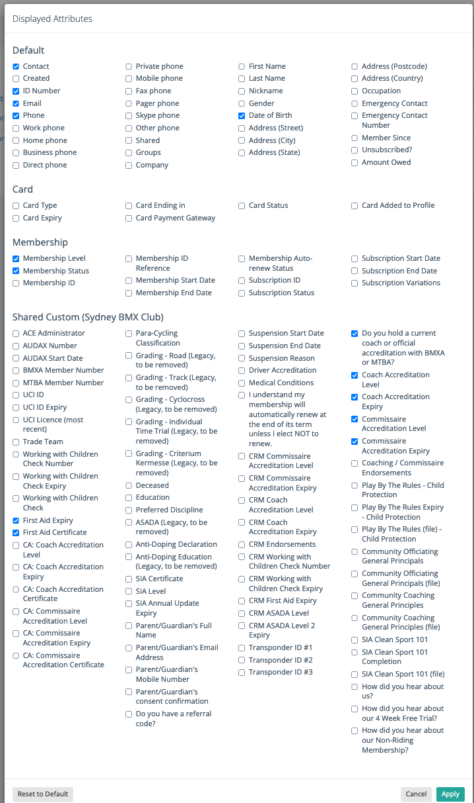

# Registrar Annual Reporter

Simple script to parse out the TidyHQ contacts export and cross-compare that against Sqorz results
and generate the most interesting stats we can from the _very_ limited TidyHQ data.

## How to use

Make sure you have a modern version of node and Yarn on your system and install the dependencies.

```shell
$ git clone https://github.com/alexgisby/bmx_club_reporter
$ cd bmx_club_reporter
$ yarn install
```

Pull the TidyHQ Contacts list by using "Export All" in the "Actions" dropdown. Make sure that you have the following
fields (exactly) set, or adjust the `src/contacts.ts` file accordingly to match the CSV:



Then run the script in the following format:

```sh
$ yarn generate [tidy-hq-csv] [sqorz-org] [reporting-year]
```

for example:

```shell
$ yarn generate ~/Downloads/26-11-2021_sydney-bmx-tidyhq-com_contacts_export.csv sydneybmx 2021
```
